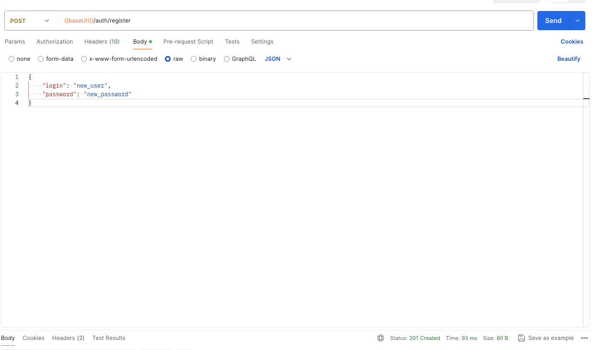
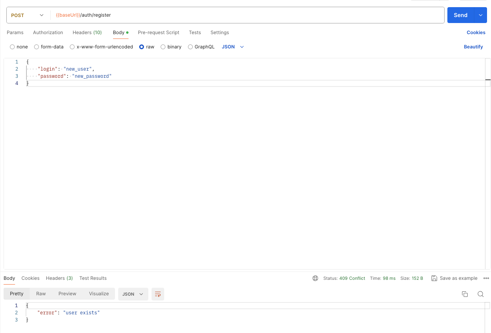
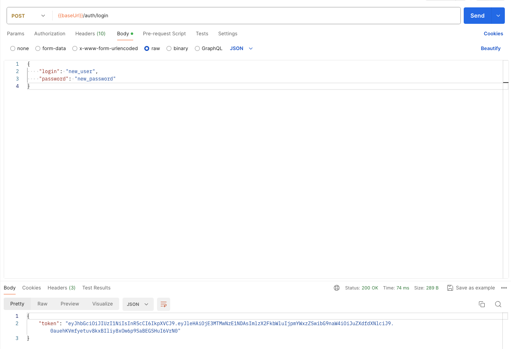

# Регистрация и авторизация

## Описание

Ручки `POST /register` и `POST /login` предназначены для регистрации пользователя в системе для получения баннеров.
Тело включает обязательные поля `login` и `password`. В ответе содержится токен пользователя.

## Примеры запросов

