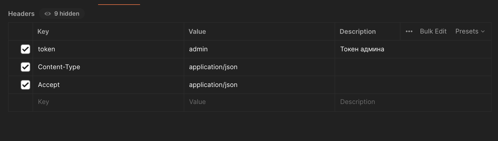
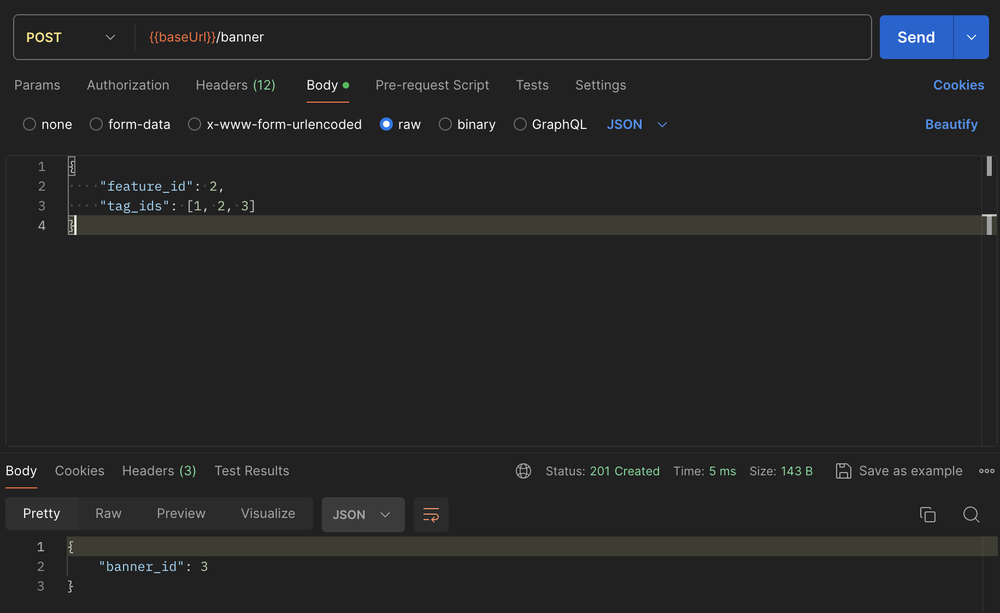
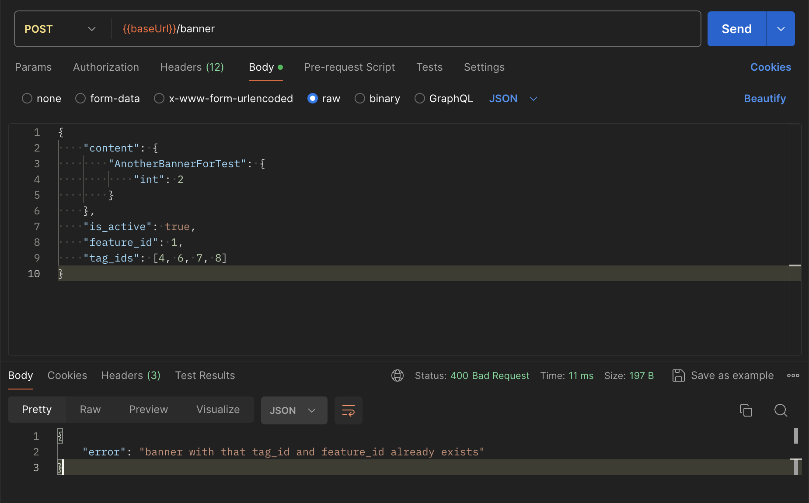
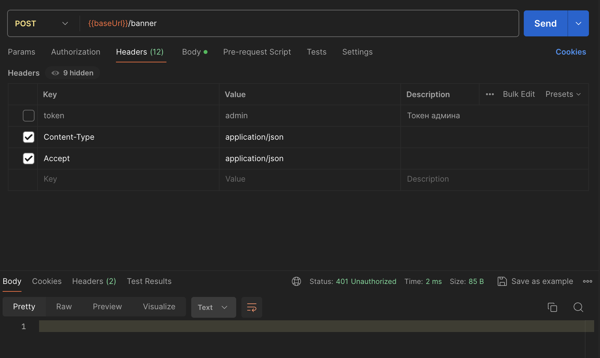
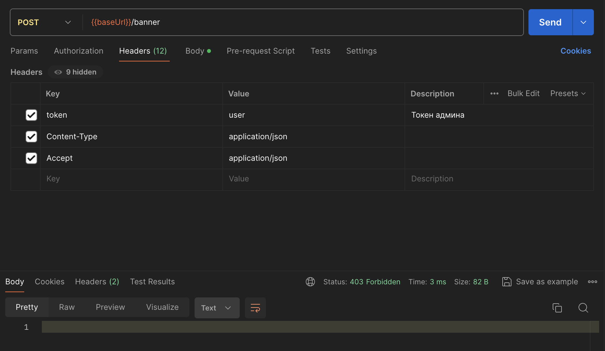

# Создание баннера
## Описание

Ручка `POST /banner` создает баннер с заданными параметрами content, tag_ids, feature_id, is_active. 
При этом если явно не указать поля content и is_active, то сервис создаст баннер со значениями `"{}"` и `False` соответственно.
Теги и фичи являются обязательными, чтобы идентифицировать баннер в системе.

## Примеры запросов и ответов

Используемые хедеры

1) Полное создание

2) Создание с неуказанными полями `content` `is_active`

3) Неверные параметры в запросе 

4) Повторяющиеся комбинация тега и фичи (`banner_id=1` из примера 1 имеет комбинацию `feature_id=1` и `tag_id=4`)

5) Без токена админа

6) Запрос не с токеном админа

Аналогично работаю все ручки кроме `GET /user_banner`