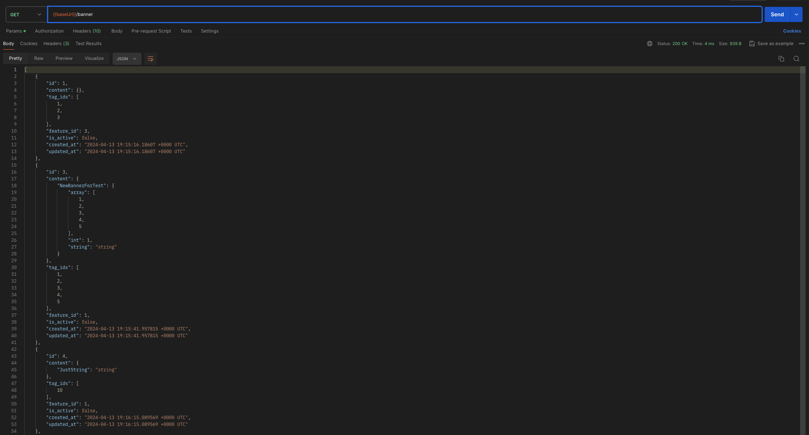
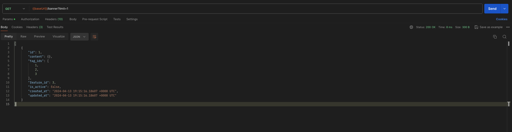
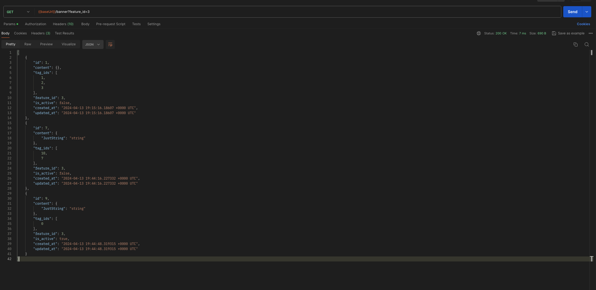
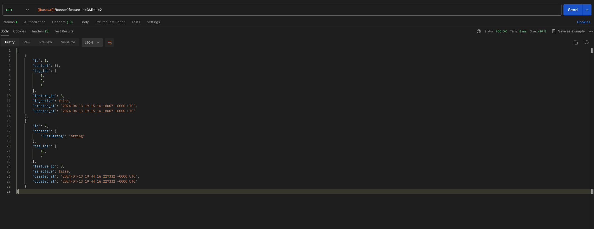
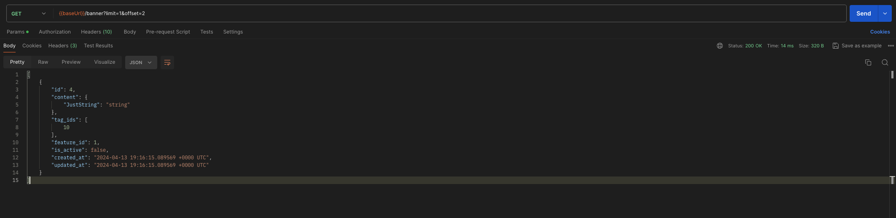
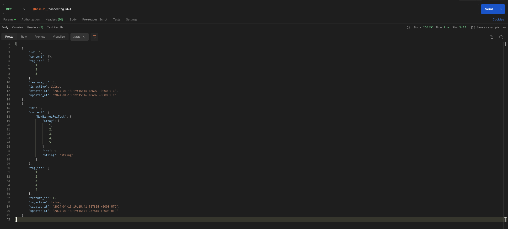

# Получение всех баннеров

## Описание

Ручка `GET /banner` нужна админам для просмотра баннеров. Доступна только по токену админа.
Опциональные параметры запроса `limit` `offset` `tag_id` `feature_id`.

## Примеры

1) Получение всего списка

2) Получение первой записи

3) Получение записей по фиче

4) Получение записей с фичей и лимитом

5) Получение одной записи со смещением 2 по списку

6) Получение записей по тегу
