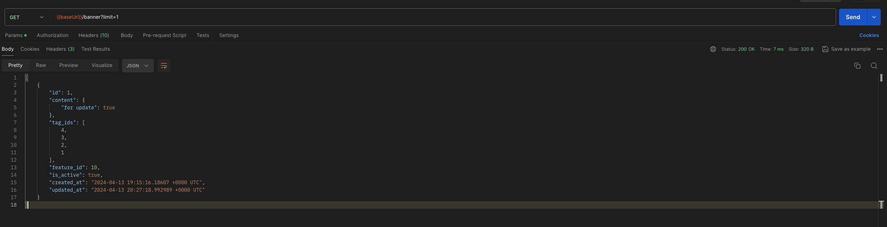

# Обновление баннера

## Описание

Ручка `PATCH /banner/:id` также доступна только по токену админа. 
Тело запроса может содержать от одного до всех параметров `content`, `tag_ids`, `feature_id`, `is_active`.
Возвращает только стату код. Валидация полей аналогична, как в ручке `POST /banner`

## Примеры запросов

Исходный баннер

1) Включение баннера

2) Обновление контента

3) Обновление тегов

4) Обновление фичи

5) Обновление тега и фичи

6) Обновление всего 

