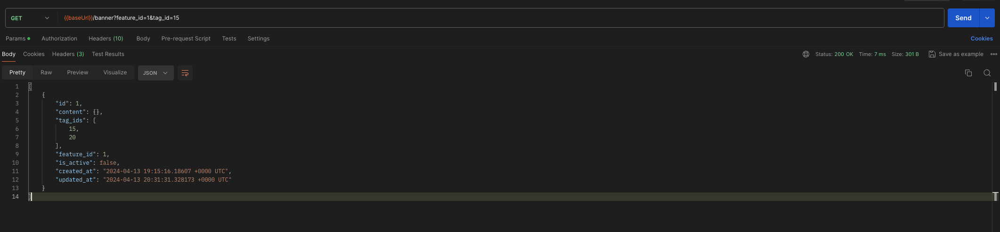
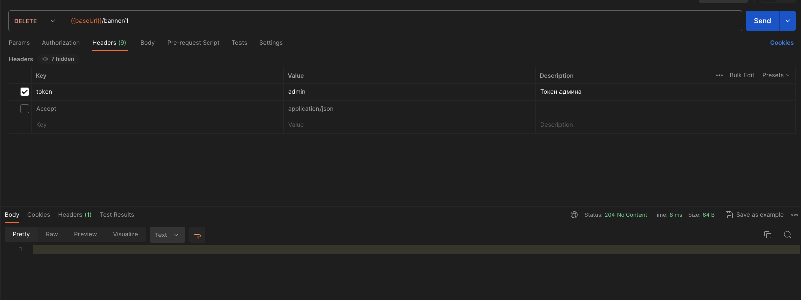
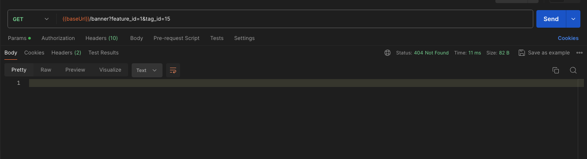
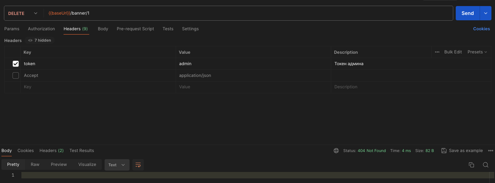

# Удаление баннера по идентификатору

## Описание

Ручка `DELETE /banner/:id` доступна только по токену админа.
Возвращает статус `204` в случае успешного удаления записи и `404`, если записи нет.

## Примеры запросов

Исходные данные

1) Удаление

