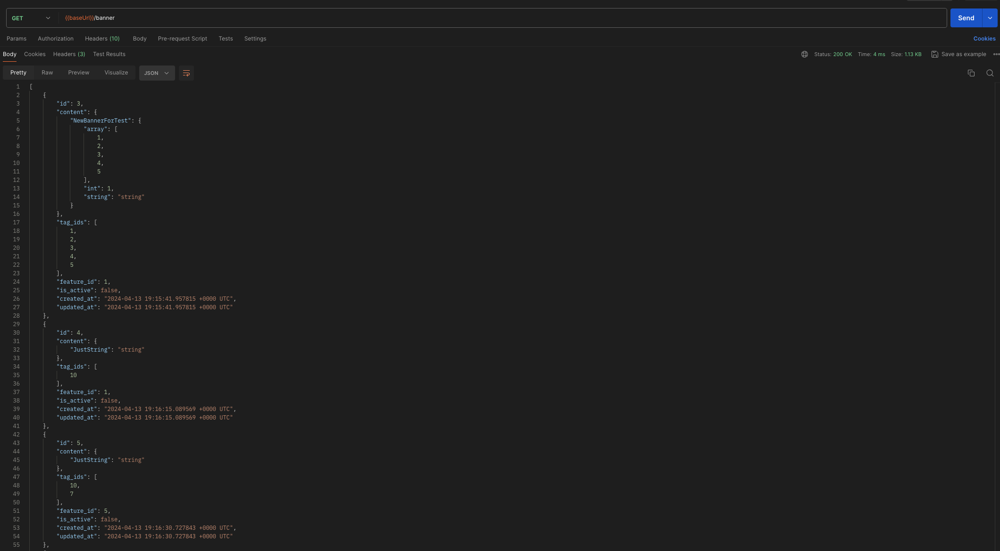
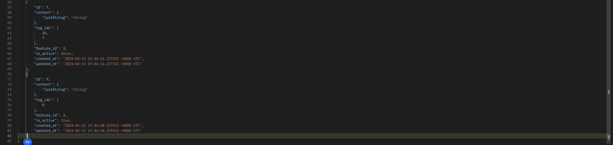
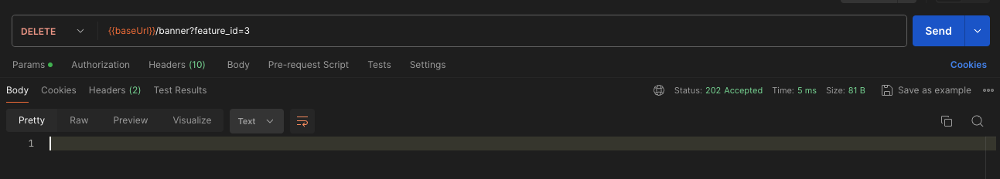
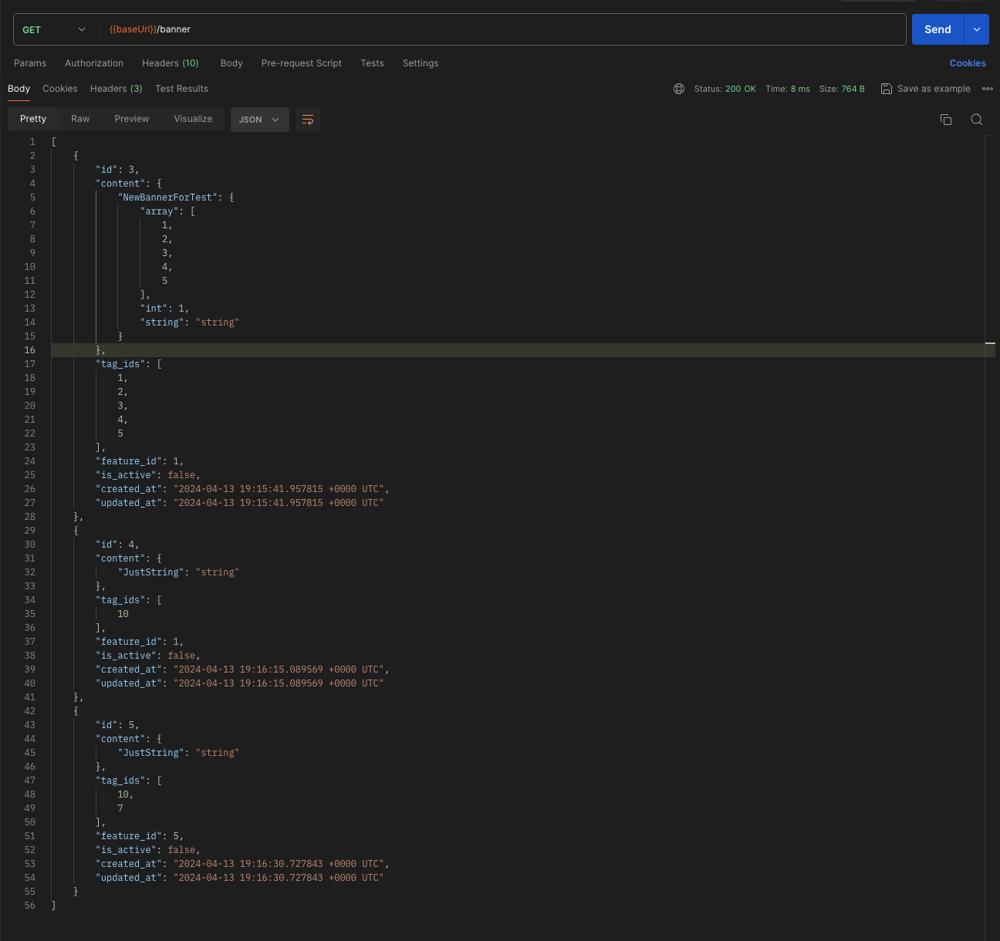
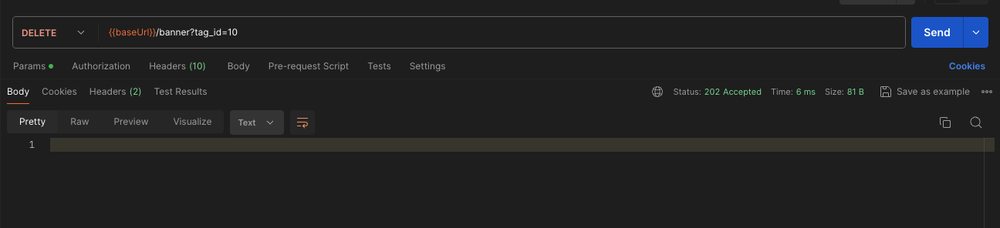
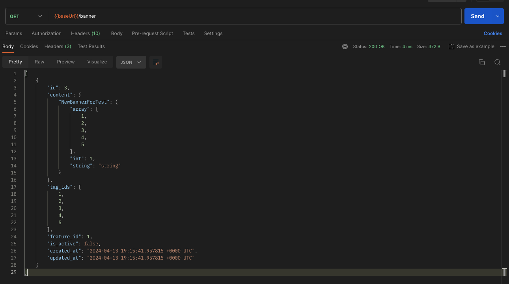

# Удаление баннеров по тегу или фиче

Ручка `DELETE /banner` удаляет все записи совпадающие с одним из параметров запроса `feature_id` и `tag_id`. 
Ручка защищена от полного удаления базы в случае, если ни один из параметров `feature_id` и `tag_id` не указан.
В случае, когда переданы оба параметра, то записи удаляются по каждому из них
(все записи с параметром равным `feature_id` удалятся и аналогично удалятся все записи с `tag_id`).
Ручка возвращает статус `202`, что означает, что задача на удаление передана в очередь для обработки воркером. 
Ручка не проверяет наличие записей в таблицах, а просто отправляет задачу в очередь.

## Примеры запросов

Исходные данные

1) Удаление записей по фиче

2) Удаление записей по тегу

