# Пользовательское получение баннера
## Описание

Ручка `GET /user_banner` рассчитана на получение контента баннера. 
Баннер может получаться по токену админа и пользователя. Обязательными параметрами запроса являются
`tag_id` и `feature_id` для однозначного определения баннера. Необязательный параметр `use_last_revision`, который 
указывает брать данные не из кеша, а напрямую из базы, по умолчанию в настройках сервиса стоит `TTL_CACHE` в 5 минут 
для баннеров. 

## Примеры запросов

Исходные данные

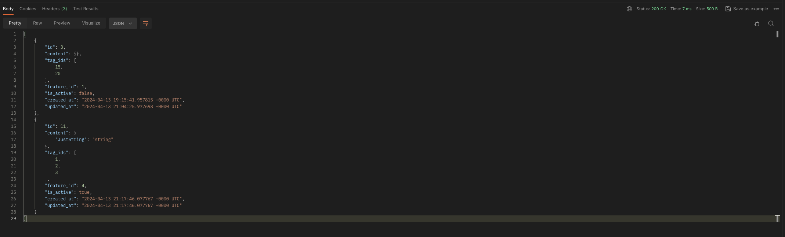

1) Получение выключенного баннера
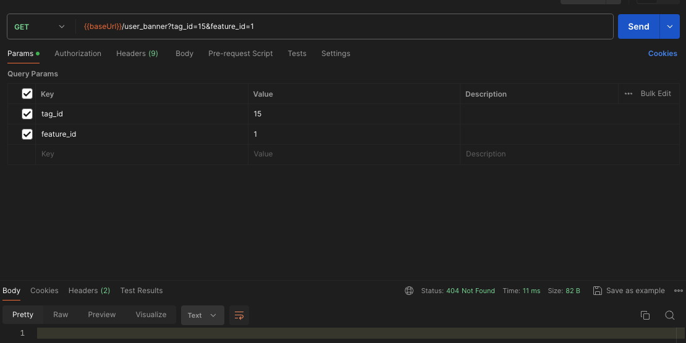
2) Получение активного баннера
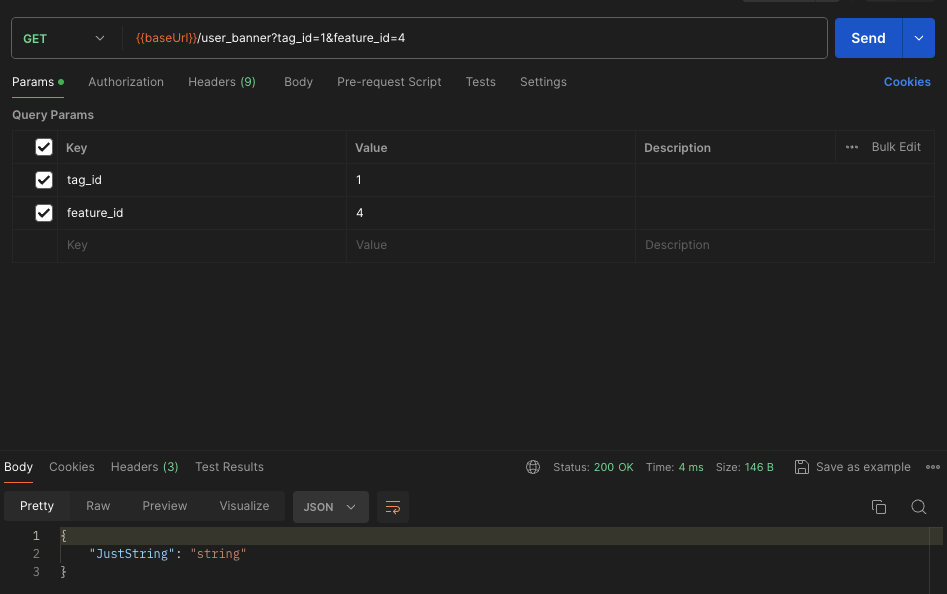
3) Получение баннера после обновления
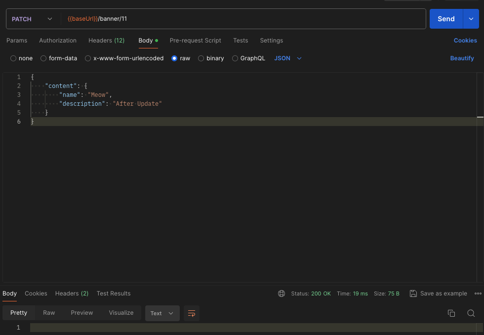
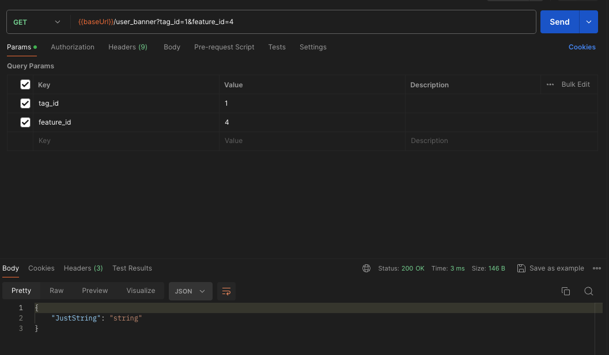
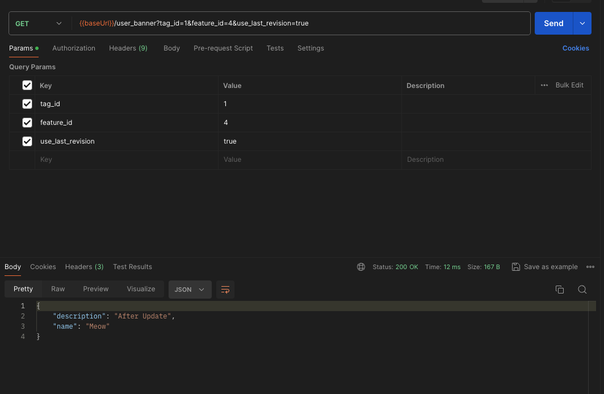
4) Невалидный запрос
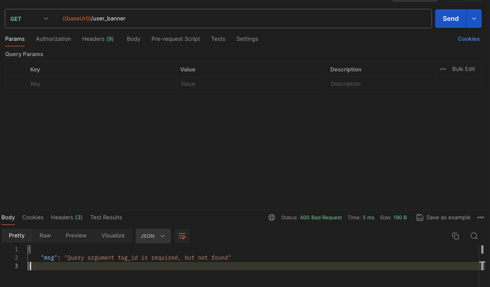
5) Получение записей от пользовательского, админского и случайного токена
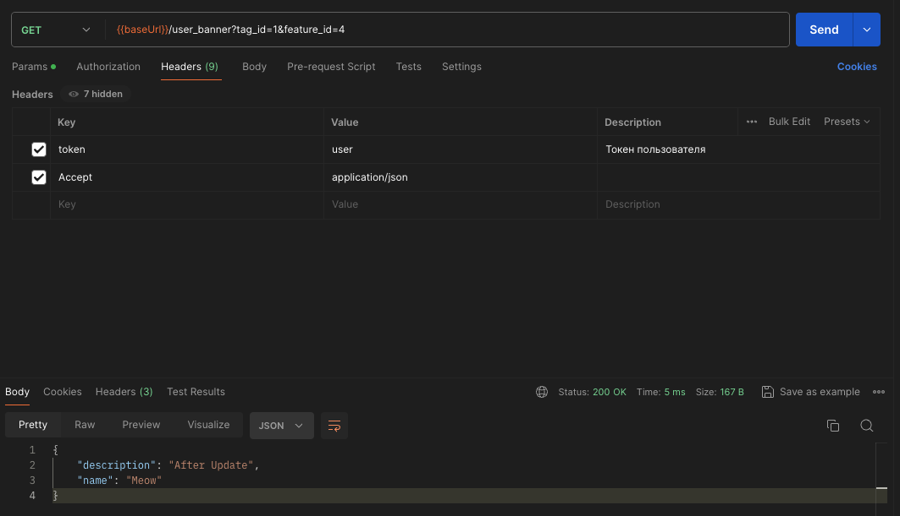
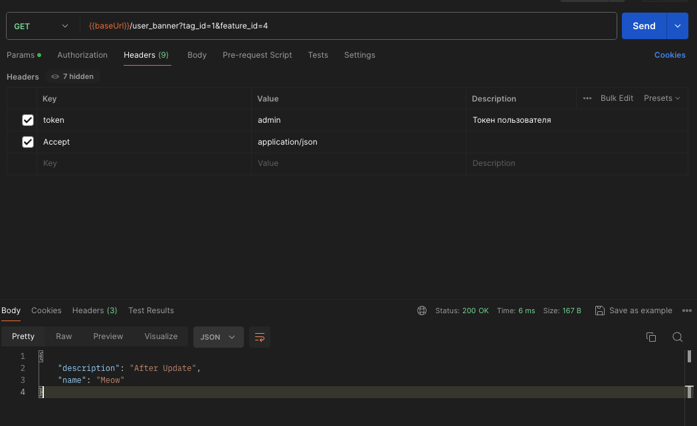
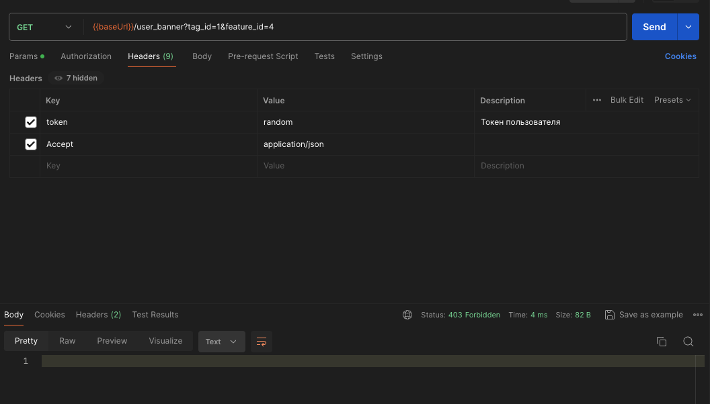
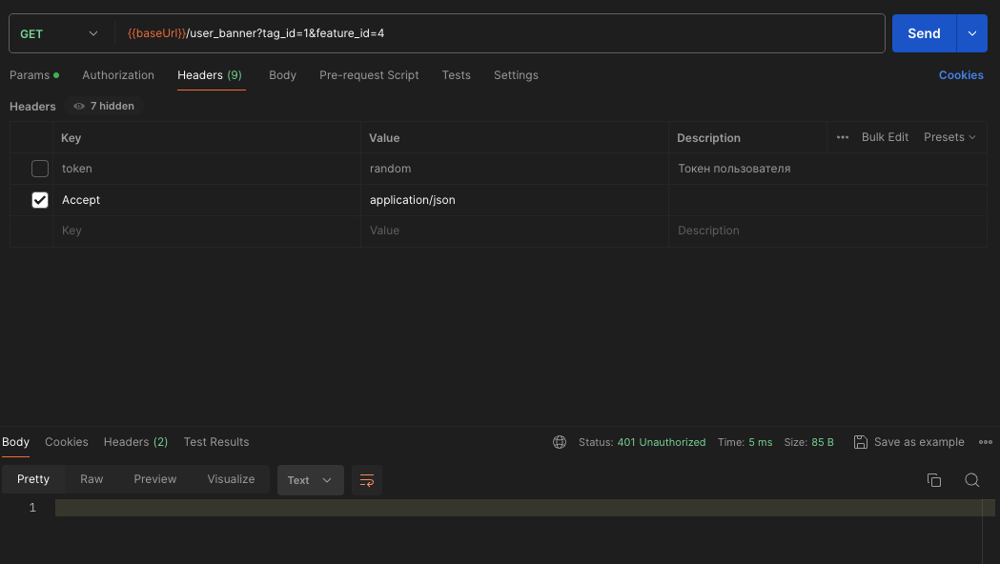